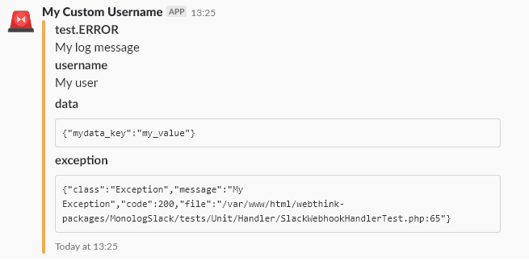

# Send logs to Slack using Monolog

[](https://codecov.io/gh/gmponos/monolog-slack)
[](https://travis-ci.org/gmponos/monolog-slack)
[](https://insight.sensiolabs.com/projects/2ba4ce7d-cdce-4424-ae6b-deae0107bace)
[](https://github.com/gmponos/monolog-slack/blob/master/LICENSE.md)

**Notice** I have created another package that contains a collection of Monolog handlers that can send your logs using a PSR-18 clients. The package is [monolog-http](https://github.com/monolog-http/monolog-http)

I will focus my efforts on the package above. If you are using the current package let me know WDYT.

Give a :star: to monolog-http if you like it.

## Description

This is a package that can help you send logs through monolog to Slack using webhooks.
Monolog already has a handler for Slack using Webhooks but I am not in favor of it for these reasons:

**It has some bugs**

- Slack accepts 2000 characters. For more details [see](https://github.com/Seldaek/monolog/issues/909). 
Current package is not able to send more than 2000 characters but it is able to send until 2000 characters 
and be well formatted.

**Flexibility**

- The Handler on this package allows you to pass your own PSR-18 client that can be configured in your own way.

**Performance**

- SlackWebhookHandler does not have timeouts and it executes retries when slack service is down [see](https://github.com/Seldaek/monolog/pull/846#issuecomment-373522968)
Because you are allowed to pass your own PSR-18 client you can have it configured in your own way.

**Formatting**

- Current package gives you the ability to add a custom formatter to the `SlackwebhookHandler` in order to format Attachments.
Monolog allows you to  pass a formatter to SlackHandlers but the formatter is applied only to simple messages of slack
and they are not applied for Attachments.
- I have created my own custom formatters. I like the formatting of Slack Records that I have more than the one that monolog has.
 
## Install

You can install this package through composer

```
$ composer require webthink/monolog-slack
```

## Documentation

### Simple initialization
You can initialize a `SlackWebhookHandler` simple with the following lines:

```php
$client = new PSR18Client(); // PSR18Client does not exist. Use your own implementation.
$requestFactory = new PSR17RequestFactory(); // PSR18Client does not exist. Use your own implementation.
$handler = new SlackWebhookHandler($client, $requestFactory, 'your_webhook_url');
```

## Formatters

### Inject custom formatter

Now if you need to pass a custom slack formatter then you can to do the following:

`$handler->setFormatter($yourFormatter);`

- **Note-1:** The formatter passed inside the slack handler must be an instance of `SlackFormatterInterface`.
- **Note-2:** If you do not pass a custom Formatter SlackWebhookHandler uses the `SlackLineFormatter` by default.

### SlackLineFormatter


### SlackShortAttachmentFormatter


### SlackLongAttachmentFormatter



## Changelog

Please see [CHANGELOG](CHANGELOG.md) for more information what has changed recently.

## Testing

1. Run `composer install` from bash.
2. Run `composer tests` from bash.
