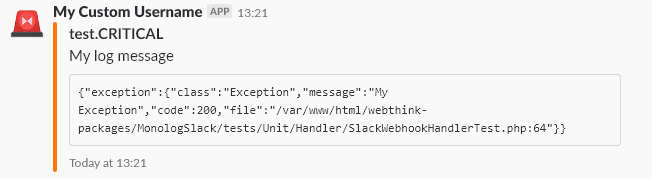

# Send logs to Slack using Monolog

[](https://codecov.io/gh/gmponos/monolog-slack)
[](https://travis-ci.org/gmponos/monolog-slack)
[](https://insight.sensiolabs.com/projects/2ba4ce7d-cdce-4424-ae6b-deae0107bace)
[](https://github.com/gmponos/monolog-slack/blob/master/LICENSE.md)

## Description

This is a package that can help you send logs through monolog to slack using webhooks.
Monolog already has a handler for Slack but I am not in favor of it for these reasons:

**It has some bugs**

- Slack accepts 2000 characters. For more details [see](https://github.com/Seldaek/monolog/issues/909). 
Current package is not able to send more than 2000 characters but it is able to send until 2000 characters 
and be well formatted.

**Performance**

- Monolog has the `WhatFailureGroupHandler` but I consider it simpler not to wrap my handler around another handler 
and have a simpler and faster logic [see](https://github.com/Seldaek/monolog/issues/920)
- SlackWebhookHandler does not have timeouts and it executes retries when slack service is down [see](https://github.com/Seldaek/monolog/pull/846#issuecomment-373522968)

**Formatting**

- Current package gives you the ability to add a custom formatter to the `SlackwebhookHandler` in order to format Attachments.
Monolog allows you to  pass a formatter to SlackHandlers but the formatter is applied only to simple messages of slack
and they are not applied for Attachments.
- I have created my custom formatters and I tend to like the formatting of Slack Records that I have created more than the one that monolog has.
 
## Install

You can install this package through composer

```
$ composer require webthink/monolog-slack
```

## Documentation

### Simple initialization
You can initialize a `SlackWebhookHandler` simple with the following lines:

`$handler = new SlackWebhookHandler('your_webhook_url');`

## Formatters

### Inject custom formatter

Now if you need to pass a custom slack formatter then you need to do the following:

`$hanlder->setFormatter($yourFormatter);`

Note that the formatter passed inside the slack handler must be an instance of `SlackFormatterInterface`.

If you do not pass a custom Formatter SlackWebhookHandler users the `SlackLineFormatter` by default.

### SlackLineFormatter


### SlackShortAttachmentFormatter



## HTTP Client.

### Initialize with a custom HTTP Client.

Inside `SlackWebhookHandler` you can inject your custom Custom HTTP client. The client that is injected must implement
a `\Webthink\MonologSlack\Utility\ClientInterface`.

`$handler = new SlackWebhookHandler('your_webhook_url', null, null, LogLevel::ERROR, true, $client);`

**Note** that if no custom client is passed as argument `SlackwebhookHandler` initializes a `\Webthink\MonologSlack\Utility\GuzzleClient` by default.

## Change log

Please see [CHANGELOG](CHANGELOG.md) for more information what has changed recently.

## Testing

1. Run `composer install` from bash.
2. Run `composer tests` from bash.

## Todo

- Use a PSR-18 client instead of a custom one.
